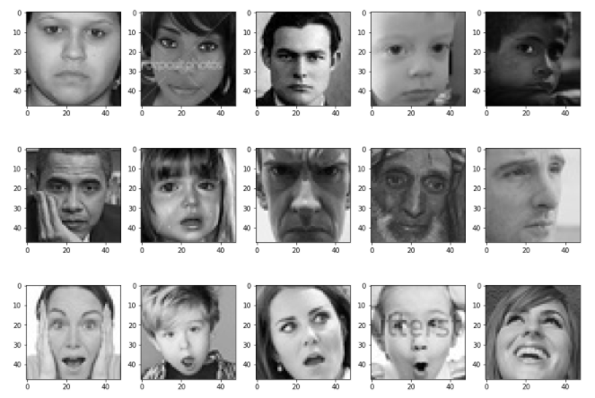

# Facial-Expression-Recognition
A facial expression recognition model in Keras with real-time video streams and image data.

  * Develop a facial expression recognition model in Keras
  * Build and train a convolutional neural network (CNN)
  * Deploy the trained model to a web interface with Flask
  * Apply the model to real-time video streams and image data
  

